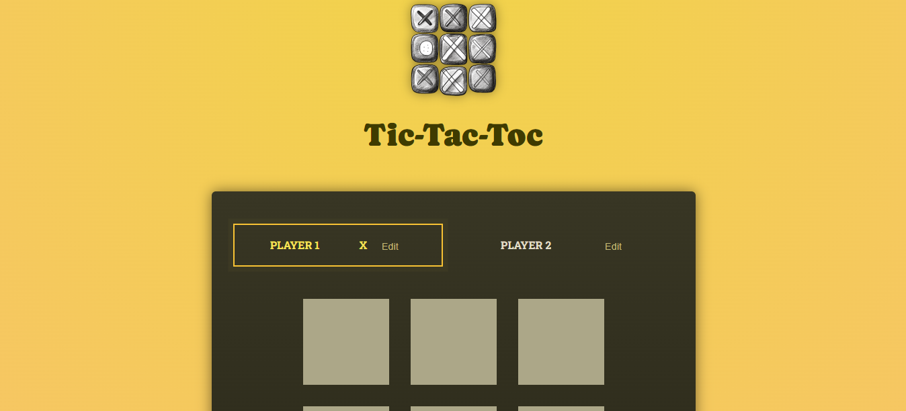

# 🎮 Tic Tac Toe

## Description

Tic Tac Toe est un jeu classique que tu peux jouer sur ton PC ou ta tablette. Ce projet a été développé en utilisant **React** et **Vite**, offrant une expérience de jeu fluide et interactive grâce à la manipulation de composants.

🔗 [Jouer au jeu en ligne !](https://martialdepaul.github.io/tic_tac_toc/)

## Technologies Utilisées

- **React** 🚀 : Bibliothèque JavaScript pour construire des interfaces utilisateur.
- **Vite** ⚡ : Outil de construction pour une expérience de développement rapide avec Hot Module Replacement (HMR).
- **ESLint** 🛠️ : Outil pour analyser et maintenir la qualité du code.

### Plugins

Ce projet utilise les plugins suivants pour React avec Vite :

- [@vitejs/plugin-react](https://github.com/vitejs/vite-plugin-react/blob/main/packages/plugin-react/README.md) - Utilise Babel pour le Fast Refresh.
- [@vitejs/plugin-react-swc](https://github.com/vitejs/vite-plugin-react-swc) - Utilise SWC pour le Fast Refresh.

 ## 🎨 Aperçu 🖼️
Voici la captures d'écran de l'application :  


## Fonctionnalités

- 🌐 Interface utilisateur réactive qui s'adapte aux écrans de PC et de tablette.
- 🎉 Jouabilité simple et intuitive.
- 🔄 Manipulation des composants React pour créer une expérience utilisateur fluide.
- ✅ Utilisation de PropTypes pour assurer la validité des propriétés des composants.

## Apprentissage

Ce projet m'a permis d'apprendre plusieurs concepts clés :

- **Manipulation de Composants** 🧩 : J'ai appris à créer et à gérer des composants en React, y compris l'utilisation des hooks et l'état local.
- **Structuration de Composants** 📦 : J'ai compris l'importance d'une bonne structuration des composants pour maintenir le code propre et modulable.
- **Dérivation de Composants** 🔗 : J'ai appliqué le concept de dérivation des composants pour réutiliser le code et éviter la duplication.
- **Utilisation de PropTypes** 📜 : J'ai découvert l'importance d'utiliser PropTypes pour valider les propriétés des composants, ce qui améliore la robustesse de l'application.

## Installation

Pour cloner ce projet, utilise la commande suivante :

```bash
git clone https://github.com/Martialdepaul/tic_tac_toc.git
```

Ensuite, installe les dépendances :

```bash
cd tic_tac_toc
npm install
```

## Exécution du Projet

Pour démarrer le serveur de développement, exécute :

```bash
npm run dev
```

Accède à l'application à l'adresse `http://localhost:3000`.

## Déploiement

Pour déployer le projet, utilise la commande suivante :

```bash
npm run deploy
```

## Contribuer 🤝

Je suis ouvert aux collaborations et aux retours d'expérience. Si tu souhaites contribuer à ce projet, n'hésite pas à ouvrir une **issue** ou à soumettre une **pull request**. 

## À l'attention des recruteurs

En tant que développeur passionné et motivé, je suis à la recherche de nouvelles opportunités dans le domaine du développement web. Mon portfolio présente mes compétences en React, Vite et d'autres technologies. Je suis disponible pour discuter de projets intéressants et de collaborations potentielles. N'hésite pas à me contacter via mon profil GitHub.

## Auteurs

- **Martial De-Paul** ✨

## License

Ce projet est sous licence MIT. Voir le fichier LICENSE pour plus d'informations.
```
